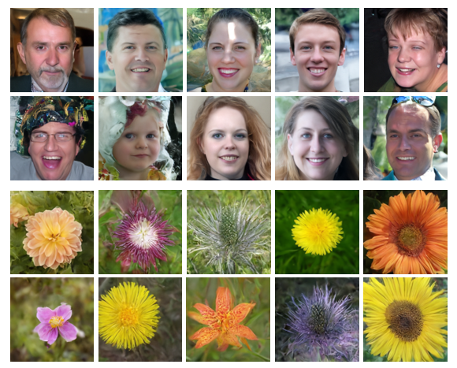
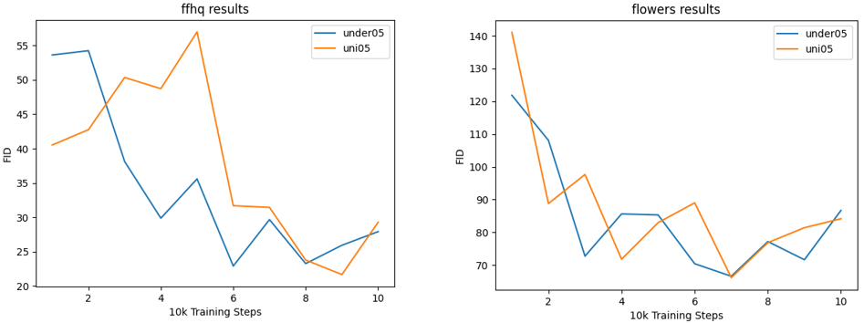

# An Efficient Training Scheme For Diffusion Models

We propose a new simple method that will speed up the training of diffusion models.
This repository is based on the work "Perception Prioritized Training of Diffusion Models" code: [jychoi118 /
P2-weighting](https://github.com/jychoi118/P2-weighting). More details on this project can be found in slides 36-47 in 
the presentation file.

## Requirements

The environment used can be found in the requirement.txt file.

## Train Model

First, set PYTHONPATH variable to point to the root of the repository:

> export PYTHONPATH=$PYTHONPATH:$(pwd)

The hyper-parameters used for running the experiments were:

> python scripts/image_train.py --data_dir data/128x128_ffhq --attention_resolutions 16 --class_cond False --diffusion_steps 1000 --dropout 0 \
--image_size 128 --learn_sigma True --noise_schedule linear --num_channels 128 --num_head_channels 64 --num_res_blocks 2 --resblock_updown True \
--use_fp16 True --use_scale_shift_norm True --lr 2e-5 --batch_size 64 --rescale_learned_sigmas True --p2_gamma 0.5 --p2_k 1 \
--log_dir logs/model1 --num_imgs 25.6 --schedule_sampler p2_under_sampler --under_sampler_gamma 0.5 \
--save_interval 10000 --grad_accum 4

## Sample Model

Sampling a trained model can be done by:

> python scripts/image_sample.py --attention_resolutions 16 --class_cond False --diffusion_steps 1000 --dropout 0.0 --image_size 128 \
--learn_sigma True --noise_schedule linear --num_channels 128 --num_res_blocks 2 --num_head_channels 64 --resblock_updown True \
--use_fp16 False --use_scale_shift_norm True --timestep_respacing 250 --model_path ${model_log_dir} --sample_dir ${samples_output} \
--use_ddim True --timestep_respacing ddim25 --batch_size 64

## Results

In the graphs below we can see the quality of generated samples from two diffusion 
models during training. The 'uni05' model was trained in a standard manner, and the 'under05' was trained by 
undersampling certain time steps during training. We can see that 'under05' converges faster than 'uni05' for FFHQ, and 
slightly faster for Oxford Flowers 102.

